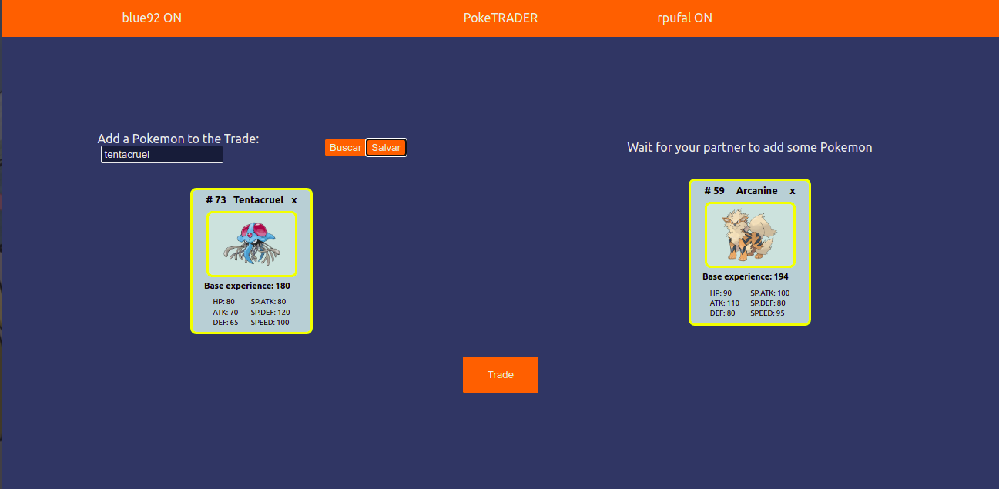
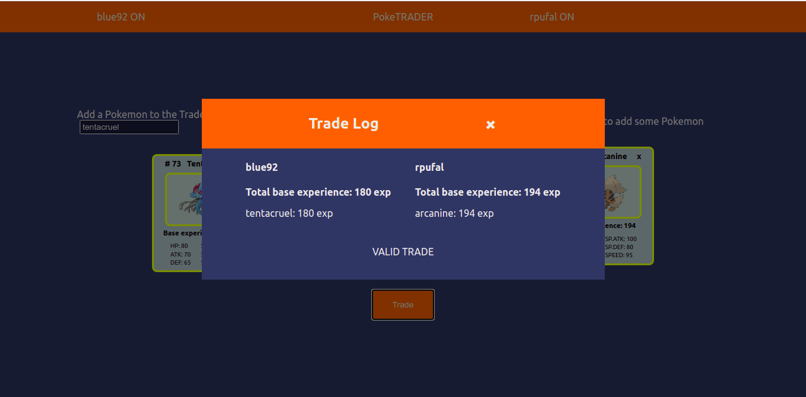

# PokeTrader - Cliente

Este arquivo serve como guia básico para a parte front-end da aplicação full-stack PokeTrade.

Essa aplicação web consiste de um cliente que vai permitir a conexão de uma pessoa em uma sala, através de Web Sockets, para realizar uma troca de 1 a 6 pokemon com outro usuário. O resultado da troca será apresentado em um modal ao final.

O processo de troca se inicia com a inserção de um nome de usuário no campo situado no canto superior esquerdo. Ao clicar em 'OK' o usuário será conectado a uma sala de troca e poderá procurar por pokemon no campo de busca e depois adicioná-lo a sua lista.



As etapas de log in e adição/remoção de pokemon serão refletidas no cliente do par da troca. Quando for propício deve-se concluir a troca acionando o botão 'Trade'.



Para utilização completa das funcionalidades duas guias do projeto devem ser abertas para averiguar a troca sendo feita.

A aplicação teve o deploy feito na plataforma Heroku e o link é o seguinte:

https://poke-trader-client.herokuapp.com/

Observação:

É possível que haja certa demora para a resposta do servidor pois o Heroku costuma hibernar a aplicação após determinado período de tempo. Basta esperar um pouco!

## Teste local

Para averiguação local basta clonar o repositório e na raiz do projeto instalar as dependências através do comando:
```sh
npm install
```
Em seguida, para iniciar a aplicação localmente é necessário ter a Porta 3000 livre e rodar o comando a seguir:
```sh
npm start
```
## Observações
Algumas mudanças de estilização podem ocorrer dependendo do tamanho do display de sua tela.
